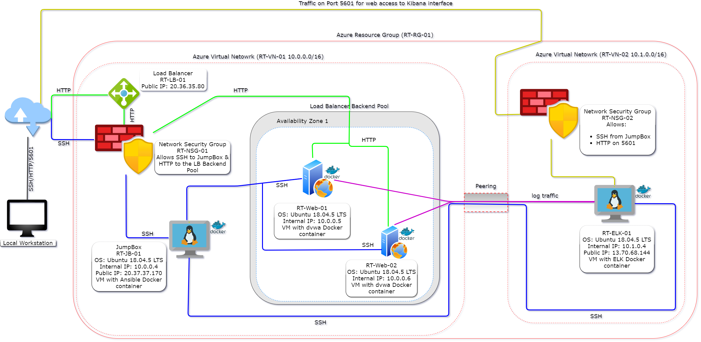

## Automated ELK Stack Deployment

The files in this repository were used to configure the network depicted below.

These files have been tested and used to generate a live ELK deployment on Azure. They can be used to either recreate the entire deployment pictured above. Alternatively, select portions of the playbook file may be used to install only certain pieces of it, such as Filebeat.

- To install elk framework - (playbooks/install-elk.yml).

Other useful playbook files:
- To install dvwa on webservers - (playbooks/webservers-playbook.yml).
- To install filebeat on webservers - (playbooks/filebeat-playbook.yml).
- To install metricebeat on webservers - (playbooks/metricbeat-playbook.yml).

This document contains the following details:
- Description of the Topology
- Access Policies
- ELK Configuration
  - Beats in Use
  - Machines Being Monitored
- How to Use the Ansible Build

### Description of the Topology

The main purpose of this network is to expose a load-balanced and monitored instance of DVWA, the D*mn Vulnerable Web Application.

Load balancing ensures that the application will be highly available, in addition to restricting traffic to the approved to the network.
- What aspect of security do load balancers protect? What is the advantage of a jump box?_
- Load Balancers protect the availability of the webservers by off=loading the function and defending the Distributed Deniel of Service (DDoS) attacks. While Jumpbox allowing SSH access to the backend of the servers for any maintenance required.

Integrating an ELK server allows users to easily monitor the vulnerable VMs for changes to the trafffic behaviour and system behaviour.
- Filebeat is to watch the logfiles of the web traffic and other service related logs.
- Matricbeat is to monitor the host behaviour along with the resource usage.

The configuration details of each machine may be found below.

| Name     | Function   | IP Address | Operating System |
|----------|------------|------------|------------------|
| Jump Box | Gateway    | 10.0.0.4   | Linux            |
| Web-01   | Web Server | 10.0.0.5   | Linux            |
| Web-02   | Web Server | 10.0.0.6   | Linux            |
| ELK      | elk Server | 10.1.0.4   | Linux            |

### Access Policies

The machines on the internal network are not exposed to the public Internet. 

Only the Jumpbox machine can accept connections from the Internet. Access to this machine is only allowed from the following IP addresses:
- Home/Private IP address (137.37.37.1) which reduces the attack surface drastically.

Machines within the network can only be accessed by Private IP.
- _TODO: Which machine did you allow to access your ELK VM? What was its IP address?_
The Jumpbox machine have SSH access to the ELK VM and the ELK VM's IP Address is 10.1.0.4
Home IP (137.37.37.1) have external access to port 5601.

A summary of the access policies in place can be found in the table below.

| Name            | Public Accessible | Allowed IP Address |
|-----------------|-------------------|--------------------|
| Jump Box        | Yes               | 137.37.37.1        |
| Web-01          | No                | 10.0.0.4 and LB    |
| Web-02          | No                | 10.0.0.4 and LB    |
| ELK             | Yes               | 137.37.37.1        |
| RT-LoadBalancer | Yes               | 137.37.37.1        |

### Elk Configuration

Ansible was used to automate configuration of the ELK machine. No configuration was performed manually, which is advantageous because...
- What is the main advantage of automating configuration with Ansible?
- It would automate the process
- Less chances of error
- Easy replication for the future deployment

The playbook implements the following tasks:
- Install Docker
- Install python
- Install Docker module
- Download and install ELK docker container
- Enable Docker service on boot

The following screenshot displays the result of running `docker ps` after successfully configuring the ELK instance.

Images/elk-dcoker-ps.png

### Target Machines & Beats
This ELK server is configured to monitor the following machines:
- Web-01 - 10.0.0.5
- Web-02 - 10.0.0.6

We have installed the following Beats on these machines:
- Filebeat
- Metricbeat

These Beats allow us to collect the following information from each machine:
- `Filebeat` collects log events by monitoring the log files or locations that are configured and forwards them to the logstash for indexing.
- `Metricbeat` collects system event events of the OS or the services that are configured and forwards them to the logstash for indexing.

### Using the Playbook
In order to use the playbook, you will need to have an Ansible control node already configured. Assuming you have such a control node provisioned: 

SSH into the control node and follow the steps below:
- Copy the install-elk.yml file to /etc/ansible.
- Update the HOSTS file to include elk server
- Run the playbook, and navigate to RT-ELK server to check that the installation worked as expected.

_TODO: Answer the following questions to fill in the blanks:_
- _Which file is the playbook? Where do you copy it?_
 Playbook is a file in yml format and it needs to be copied to the ansible container so that it could be executed.
- _Which file do you update to make Ansible run the playbook on a specific machine? How do I specify which machine to install the ELK server on versus which to install Filebeat on?_
  - Hosts file need to be updated with the definition for ELK server entry so that the ELK installation playbook could have the right host declared. Elk server need to be installed on the new VM created for ELK (RT-ELK) and the beats need to be installed on the webservers to gather the system logs and the metrics as required.
- _Which URL do you navigate to in order to check that the ELK server is running?
  - To check if if elk installation has been successful, you should be able to try http://elk-publi-ip:5601; this should give you Kibana interface where if the beats are configured properly, should see the logs coming in.
  - another way of checking is in the ansible container, you could execute the following command to see if it returns the webpage: ansible elk -m command -a "curl http://127.0.0.1:5601/app/kibana"

_As a **Bonus**, provide the specific commands the user will need to run to download the playbook, update the files, etc._
