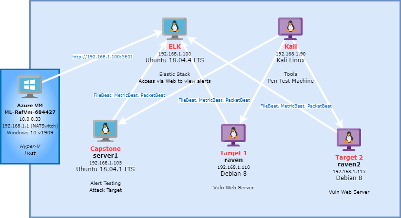
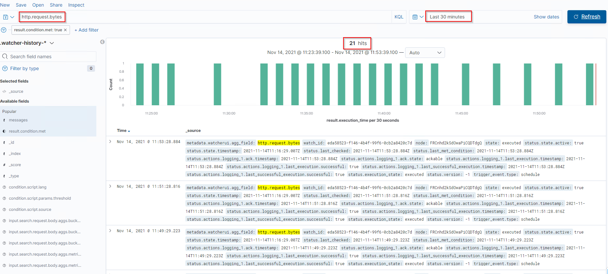
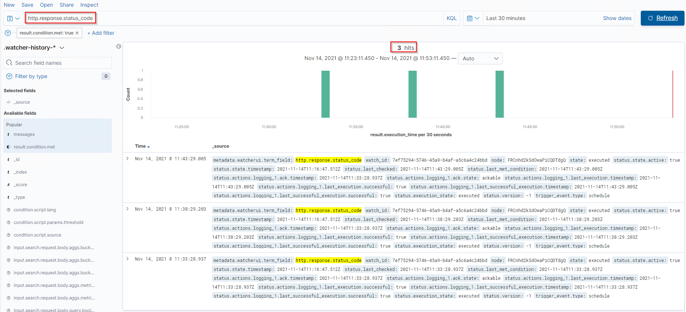
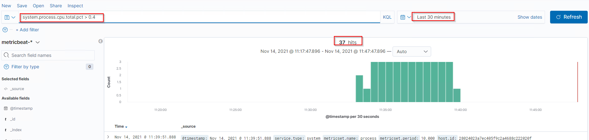

# Blue Team: Summary of Operations

## Table of Contents
- Network Topology
- Description of Targets
- Monitoring the Targets
- Patterns of Traffic & Behavior
- Suggestions for Going Further

### Network Topology

The following machines were identified on the network:
- Kali
  - **Operating System**: Kali Linux
  - **Purpose**: Attacking Machine
  - **IP Address**: 192.168.1.90
- ELK
  - **Operating System**: Ubuntu 18.04.4 LTS
  - **Purpose**: Event log server and alerting
  - **IP Address**: 192.168.1.100
- Capstone
  - **Operating System**: Ubuntu 18.04.4 LTS
  - **Purpose**: Use as a test vulnerable machine to see if the events are logged to the ELK server.
  - **IP Address**: 192.168.1.105
- Target 1
  - **Operating System**: Debian 8
  - **Purpose**: Webserver (Target Machine)
  - **IP Address**: 192.168.1.110
- Target 2
  - **Operating System**: Debian 8
  - **Purpose**: Webserver (Target Machine)
  - **IP Address**: 192.168.1.115

### Description of Targets
_TODO: Answer the questions below._

The target of this attack was: `Target 1` - IP Address: 192.168.1.110

Target 1 is an Apache web server and has SSH enabled, so ports 80 and 22 are possible ports of entry for attackers. As such, the following alerts have been implemented:

### Monitoring the Targets

Traffic to these services should be carefully monitored. To this end, we have implemented the alerts below:

#### Name of Alert 1

'HTTP Request Size Monitor'  is implemented as follows:
  - **Metric**: http.request.bytes
  - **Threshold**: total of 3500b or more in the last 1 min. 
  - **Vulnerability Mitigated**: dirb and wpscan, any file downloads
  - **Reliability**: This alert is triggering too many false positives over a span.

  

#### Name of Alert 2
'Excessive HTTP Errors' is implemented as follows:
  - **Metric**: http.response.status_code
  - **Threshold**: Top 5 error codes with 400 or above in last 5mins
  - **Vulnerability Mitigated**: Probing for non-existant files/resources (works against dirb)
  - **Reliability**: This seems to be highly reliable.

#### Name of Alert 3
'CPU Usage Monitor' is implemented as follows:
  - **Metric**: system.process.cpu.total.pct
  - **Threshold**: above 0.5 for the last 5mins. (0.5 works out to be 50% of the non-idle time & I/O wait time)
  - **Vulnerability Mitigated**: Resource hogging leading to DOS attack.
  - **Reliability**: false negatives, and the reliability is low. Found that the CPU was more for less than 50% so the threshold should be set to atleast 0.4.

_TODO Note: Explain at least 3 alerts. Add more if time allows._

### Suggestions for Going Further (Optional)
_TODO_: 
- Each alert above pertains to a specific vulnerability/exploit. Recall that alerts only detect malicious behavior, but do not stop it. For each vulnerability/exploit identified by the alerts above, suggest a patch. E.g., implementing a blocklist is an effective tactic against brute-force attacks. It is not necessary to explain _how_ to implement each patch.

The logs and alerts generated during the assessment suggest that this network is susceptible to several active threats, identified by the alerts above. In addition to watching for occurrences of such threats, the network should be hardened against them. The Blue Team suggests that IT implement the fixes below to protect the network:
- Website scanning (wpscan, dirb)
  - **Patch**: Implementing WAF, POLP and plugins like 'Stop User Enumeration' and 'WPScan' (yes, I know the irony :) ) that secures the information and blocks the scans.
  - **Why It Works**: A blocked scan would result in lack for information for the attacker which would either stop or slow down the attack.
- Probing for Vulnerable Code
  - **Patch**: Regular System and application updates, monitoring evenlogs for status codes especially for 400 and above.
  - **Why It Works**: Keeping the environment patched will minimise the attack surface with known vulnerabilities and monitoring for response codes with 400 and above alerts when there are more than anticipated errors.
- Resource depletion and possible DOS attack
  - **Patch**: Implementing WAF and is possible/applicable load balancer.
  - **Why It Works**: If a DOS attack could be detected and blocked in the early stages with the use of a firewall, could save possible the disrution and there by saving all the frustrations.
