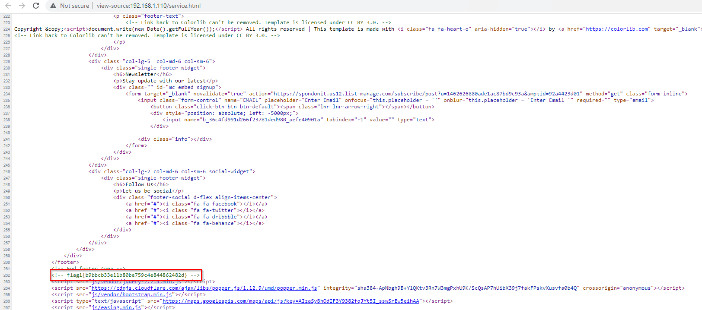
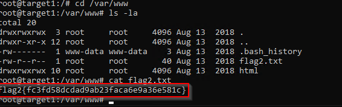
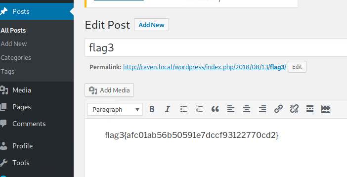
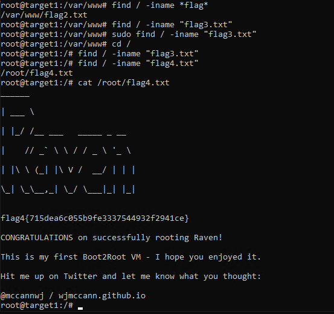

# Red Team: Summary of Operations

## Table of Contents
- Exposed Services
- Critical Vulnerabilities
- Exploitation

### Exposed Services
_TODO: Fill out the information below._

Nmap scan results for each machine reveal the below services and OS details:

```bash
root@Kali:~# nmap -O -sV 192.168.1.0/24
Starting Nmap 7.80 ( https://nmap.org ) at 2021-11-14 22:20 PST
Nmap scan report for 192.168.1.1
Host is up (0.00060s latency).
Not shown: 995 filtered ports
PORT     STATE SERVICE       VERSION
135/tcp  open  msrpc         Microsoft Windows RPC
139/tcp  open  netbios-ssn   Microsoft Windows netbios-ssn
445/tcp  open  microsoft-ds?
2179/tcp open  vmrdp?
3389/tcp open  ms-wbt-server Microsoft Terminal Services
MAC Address: 00:15:5D:00:04:0D (Microsoft)
Warning: OSScan results may be unreliable because we could not find at least 1 open and 1 closed port
Device type: general purpose
Running (JUST GUESSING): Microsoft Windows 2008|XP (86%)
OS CPE: cpe:/o:microsoft:windows_server_2008::sp1 cpe:/o:microsoft:windows_server_2008:r2 cpe:/o:microsoft:windows_xp::sp2
Aggressive OS guesses: Microsoft Windows Server 2008 SP1 or Windows Server 2008 R2 (86%), Microsoft Windows XP SP2 (85%)
No exact OS matches for host (test conditions non-ideal).
Network Distance: 1 hop
Service Info: OS: Windows; CPE: cpe:/o:microsoft:windows

Nmap scan report for 192.168.1.100
Host is up (0.00068s latency).
Not shown: 998 closed ports
PORT     STATE SERVICE VERSION
22/tcp   open  ssh     OpenSSH 7.6p1 Ubuntu 4ubuntu0.3 (Ubuntu Linux; protocol 2.0)
9200/tcp open  http    Elasticsearch REST API 7.6.1 (name: elk; cluster: elasticsearch; Lucene 8.4.0)
MAC Address: 4C:EB:42:D2:D5:D7 (Intel Corporate)
No exact OS matches for host (If you know what OS is running on it, see https://nmap.org/submit/ ).
TCP/IP fingerprint:
OS:SCAN(V=7.80%E=4%D=11/14%OT=22%CT=1%CU=43378%PV=Y%DS=1%DC=D%G=Y%M=4CEB42%
OS:TM=6191FC6E%P=x86_64-pc-linux-gnu)SEQ(SP=106%GCD=1%ISR=10C%TI=Z%CI=Z%II=
OS:I%TS=A)OPS(O1=M5B4ST11NW7%O2=M5B4ST11NW7%O3=M5B4NNT11NW7%O4=M5B4ST11NW7%
OS:O5=M5B4ST11NW7%O6=M5B4ST11)WIN(W1=FE88%W2=FE88%W3=FE88%W4=FE88%W5=FE88%W
OS:6=FE88)ECN(R=Y%DF=Y%T=40%W=FAF0%O=M5B4NNSNW7%CC=Y%Q=)T1(R=Y%DF=Y%T=40%S=
OS:O%A=S+%F=AS%RD=0%Q=)T2(R=N)T3(R=N)T4(R=Y%DF=Y%T=40%W=0%S=A%A=Z%F=R%O=%RD
OS:=0%Q=)T5(R=Y%DF=Y%T=40%W=0%S=Z%A=S+%F=AR%O=%RD=0%Q=)T6(R=Y%DF=Y%T=40%W=0
OS:%S=A%A=Z%F=R%O=%RD=0%Q=)T7(R=Y%DF=Y%T=40%W=0%S=Z%A=S+%F=AR%O=%RD=0%Q=)U1
OS:(R=Y%DF=N%T=40%IPL=164%UN=0%RIPL=G%RID=G%RIPCK=G%RUCK=G%RUD=G)IE(R=Y%DFI
OS:=N%T=40%CD=S)

Network Distance: 1 hop
Service Info: OS: Linux; CPE: cpe:/o:linux:linux_kernel

Nmap scan report for 192.168.1.105
Host is up (0.00061s latency).
Not shown: 998 closed ports
PORT   STATE SERVICE VERSION
22/tcp open  ssh     OpenSSH 7.6p1 Ubuntu 4ubuntu0.3 (Ubuntu Linux; protocol 2.0)
80/tcp open  http    Apache httpd 2.4.29
MAC Address: 00:15:5D:00:04:0F (Microsoft)
No exact OS matches for host (If you know what OS is running on it, see https://nmap.org/submit/ ).
TCP/IP fingerprint:
OS:SCAN(V=7.80%E=4%D=11/14%OT=22%CT=1%CU=44428%PV=Y%DS=1%DC=D%G=Y%M=00155D%
OS:TM=6191FC6E%P=x86_64-pc-linux-gnu)SEQ(SP=105%GCD=1%ISR=10C%TI=Z%CI=Z%II=
OS:I%TS=A)OPS(O1=M5B4ST11NW7%O2=M5B4ST11NW7%O3=M5B4NNT11NW7%O4=M5B4ST11NW7%
OS:O5=M5B4ST11NW7%O6=M5B4ST11)WIN(W1=FE88%W2=FE88%W3=FE88%W4=FE88%W5=FE88%W
OS:6=FE88)ECN(R=Y%DF=Y%T=40%W=FAF0%O=M5B4NNSNW7%CC=Y%Q=)T1(R=Y%DF=Y%T=40%S=
OS:O%A=S+%F=AS%RD=0%Q=)T2(R=N)T3(R=N)T4(R=Y%DF=Y%T=40%W=0%S=A%A=Z%F=R%O=%RD
OS:=0%Q=)T5(R=Y%DF=Y%T=40%W=0%S=Z%A=S+%F=AR%O=%RD=0%Q=)T6(R=Y%DF=Y%T=40%W=0
OS:%S=A%A=Z%F=R%O=%RD=0%Q=)T7(R=Y%DF=Y%T=40%W=0%S=Z%A=S+%F=AR%O=%RD=0%Q=)U1
OS:(R=Y%DF=N%T=40%IPL=164%UN=0%RIPL=G%RID=G%RIPCK=G%RUCK=G%RUD=G)IE(R=Y%DFI
OS:=N%T=40%CD=S)

Network Distance: 1 hop
Service Info: Host: 192.168.1.105; OS: Linux; CPE: cpe:/o:linux:linux_kernel

Nmap scan report for target1 (192.168.1.110)
Host is up (0.00081s latency).
Not shown: 995 closed ports
PORT    STATE SERVICE     VERSION
22/tcp  open  ssh         OpenSSH 6.7p1 Debian 5+deb8u4 (protocol 2.0)
80/tcp  open  http        Apache httpd 2.4.10 ((Debian))
111/tcp open  rpcbind     2-4 (RPC #100000)
139/tcp open  netbios-ssn Samba smbd 3.X - 4.X (workgroup: WORKGROUP)
445/tcp open  netbios-ssn Samba smbd 3.X - 4.X (workgroup: WORKGROUP)
MAC Address: 00:15:5D:00:04:10 (Microsoft)
Device type: general purpose
Running: Linux 3.X|4.X
OS CPE: cpe:/o:linux:linux_kernel:3 cpe:/o:linux:linux_kernel:4
OS details: Linux 3.2 - 4.9
Network Distance: 1 hop
Service Info: OS: Linux; CPE: cpe:/o:linux:linux_kernel

Nmap scan report for 192.168.1.115
Host is up (0.00088s latency).
Not shown: 995 closed ports
PORT    STATE SERVICE     VERSION
22/tcp  open  ssh         OpenSSH 6.7p1 Debian 5+deb8u4 (protocol 2.0)
80/tcp  open  http        Apache httpd 2.4.10 ((Debian))
111/tcp open  rpcbind     2-4 (RPC #100000)
139/tcp open  netbios-ssn Samba smbd 3.X - 4.X (workgroup: WORKGROUP)
445/tcp open  netbios-ssn Samba smbd 3.X - 4.X (workgroup: WORKGROUP)
MAC Address: 00:15:5D:00:04:11 (Microsoft)
Device type: general purpose
Running: Linux 3.X|4.X
OS CPE: cpe:/o:linux:linux_kernel:3 cpe:/o:linux:linux_kernel:4
OS details: Linux 3.2 - 4.9
Network Distance: 1 hop
Service Info: Host: TARGET2; OS: Linux; CPE: cpe:/o:linux:linux_kernel

Nmap scan report for 192.168.1.90
Host is up (0.000061s latency).
Not shown: 999 closed ports
PORT   STATE SERVICE VERSION
22/tcp open  ssh     OpenSSH 8.1p1 Debian 5 (protocol 2.0)
Device type: general purpose
Running: Linux 2.6.X
OS CPE: cpe:/o:linux:linux_kernel:2.6.32
OS details: Linux 2.6.32
Network Distance: 0 hops
Service Info: OS: Linux; CPE: cpe:/o:linux:linux_kernel

OS and Service detection performed. Please report any incorrect results at https://nmap.org/submit/ .
Nmap done: 256 IP addresses (6 hosts up) scanned in 42.66 seconds
root@Kali:~#
```

This scan identifies the services below as potential points of entry:
- Target 1
  - http
  - ssh

_TODO: Fill out the list below. Include severity, and CVE numbers, if possible._

The following vulnerabilities were identified on each target:
- Target 1
  - Weak Authentication
  - Password authentication for SSH
  - Folder & File Enumeration

_TODO: Include vulnerability scan results to prove the identified vulnerabilities._

### Exploitation
_TODO: Fill out the details below. Include screenshots where possible._

The Red Team was able to penetrate `Target 1` and retrieve the following confidential data:
- Target 1
  - `flag1.txt`: b9bbcb33e11b80be759c4e844862482d
    - **Exploit Used**
      - Weak Password
      - ssh michael@192.168.1.110
      - cd /var/www/html
      - grep -R flag1
    
    
  - `flag2.txt`: fc3fd58dcdad9ab23faca6e9a36e581c
    - **Exploit Used**
      - Weak Password
      - ssh michael@192.168.1.110
      - cd /var/www/html
      - cat flag2.txt

    
  - `flag3.txt`: afc01ab56b50591e7dccf93122770cd2
    - **Exploit Used**
      - Folder Enumeration & mysql exploitation
      - mysql> select * from wp_posts

    
  - `flag4.txt`: 715dea6c055b9fe3337544932f2941ce
    - **Exploit Used**  
      - privilage escalation
      - cd /root
      - cat flag4.txt

    
